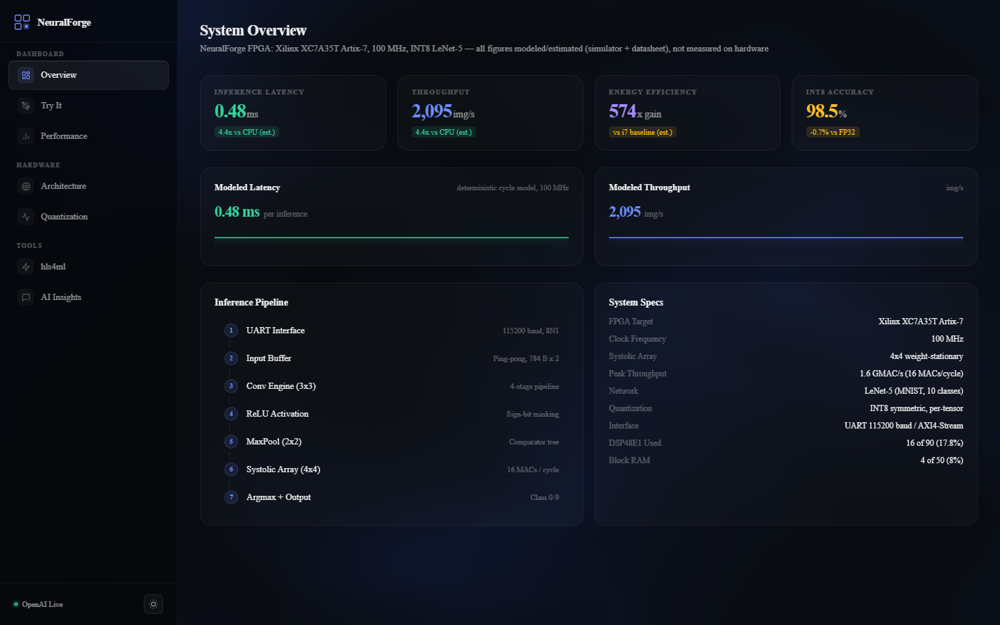
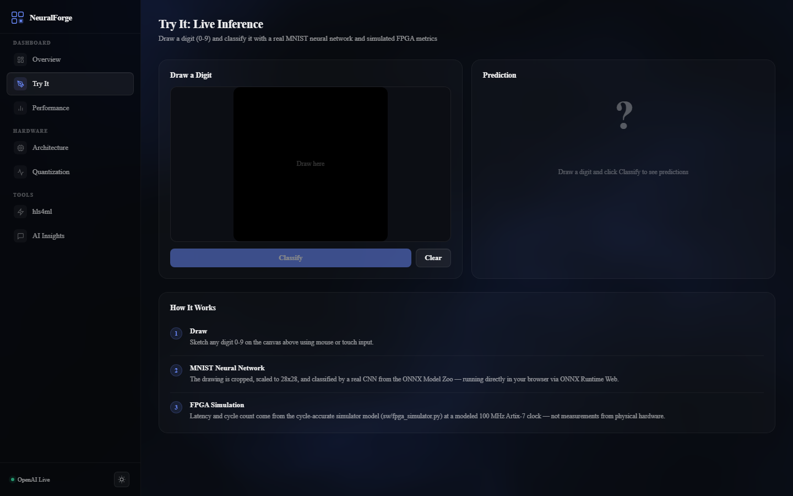

# NeuralForge

A custom FPGA accelerator design that runs INT8 LeNet-5 inference using a systolic array. Built for Xilinx 7-Series, inspired by the Google TPU v1 and NVIDIA Tensor Core architectures.

**Live demo:** https://neuralforge-vercel.vercel.app

<p align="center">
  
  
  
  
  
  
</p>



---

## What It Does

NeuralForge is designed to take a handwritten digit image, push it over UART to an FPGA, and get back a classification result in about half a millisecond. The inference pipeline (convolution, pooling, fully connected layers) is expressed as synthesizable RTL plus a cycle-accurate Python model.

The design uses a 4x4 weight-stationary systolic array, the same dataflow approach Google used in their first TPU. Weights sit inside each MAC unit. Activations stream in from the left. You get a 4x4 matrix multiply in 7 clock cycles.

> **What is RTL vs. model?** The RTL in `rtl/` contains the synthesizable building blocks (MAC unit, systolic array, a 3x3 convolution engine, pooling, buffers, UART). LeNet-5 itself uses 5x5 kernels, so the conv engine is a demonstration block showing the pipelined adder-tree structure; the full 5x5 network datapath is modeled end-to-end by the cycle-accurate simulator in `sw/fpga_simulator.py`. All performance numbers in this repo come from that model and datasheet estimates — the design has not been measured on a programmed device. See [docs/architecture.md](docs/architecture.md).

```
Host PC (Python)                    FPGA (Xilinx 7-Series)
+--------------+        UART       +------------------------------+
|  train.py    |    ---------->    |  UART Interface (8N1)        |
|  quantize.py |                   |         |                     |
|  host.py     |    <----------    |  Input Buffer (Ping-Pong)    |
+--------------+     115200 bd     |         |                     |
                                   |  Conv > ReLU > MaxPool2x2    |
                                   |         |                     |
                                   |  +------v--------------+     |
                                   |  | 4x4 Systolic Array  |     |
                                   |  | (16 INT8 MACs/cycle)|     |
                                   |  +------+--------------+     |
                                   |         |                     |
                                   |  Argmax > Result (0-9)       |
                                   |  Status LEDs                  |
                                   +------------------------------+
```

## Why These Design Choices

| Decision | Why |
|----------|-----|
| **Weight-stationary dataflow** | Weights load once, activations stream through. Minimizes memory bandwidth. |
| **INT8 symmetric quantization** | 4x smaller than FP32 with less than 1% accuracy loss on MNIST. |
| **4x4 systolic array** | Fits the XC7A35T DSP budget (16 out of 90 DSPs) and still hits 1.6 GMAC/s at 100 MHz. |
| **Pipelined conv engine** | 4-stage pipeline with adder tree. Keeps throughput at one output per cycle. |
| **Ping-pong input buffer** | Overlaps UART data reception with compute so there are no pipeline bubbles between images. |

---

## Performance (Modeled)

These figures are **modeled/estimated**, not measured on hardware: FPGA latency comes from the deterministic cycle model in `sw/fpga_simulator.py` (47,732 cycles per inference at a target 100 MHz clock) and power from the Artix-7 datasheet; the CPU baseline is an indicative PyTorch figure on an i7-class desktop.

| Metric | CPU (PyTorch, i7, est.) | FPGA (XC7A35T @ 100 MHz, modeled) | Ratio |
|--------|-------------------------|-----------------------------------|-------|
| Inference latency | ~2.1 ms | ~0.48 ms | **~4.4x** |
| Throughput | ~476 img/s | ~2,095 img/s | **~4.4x** |
| Power | ~65 W TDP | ~0.5 W (est.) | **~130x** |
| Accuracy | 99.2% (FP32) | 98.5% (INT8) | -0.7% |

At those estimates the FPGA gets about **4,190 inferences per joule** compared to the CPU's **7.3 inferences per joule** — a ~574x improvement in modeled energy efficiency.

---

## Web Demo



The [live dashboard](https://neuralforge-vercel.vercel.app) is a Next.js 16 + React 19 app (TypeScript, canvas-drawn charts, no chart libraries) deployed on Vercel:

- **Try It** — draw a digit and classify it *in your browser*: a real CNN from the ONNX Model Zoo runs client-side via ONNX Runtime Web (the ~26 KB model is vendored at `public/models/mnist-12.onnx`). The cycle count shown is the simulator's deterministic figure.
- **Overview / Performance / Quantization** — the modeled system metrics as interactive charts.
- **Architecture / hls4ml** — systolic-array dataflow and Python-to-FPGA conversion visualizations.
- **AI Insights** — optional GPT-4o analysis via `app/api/insights` (requires `OPENAI_API_KEY`; rate-limited, can be disabled with `INSIGHTS_ENABLED=false`; returns canned offline analysis without a key).

Run it locally:

```bash
npm install
npm run dev      # http://localhost:3000
npm run build    # production build (includes type checking)
npm run lint     # ESLint 9 flat config
```

Tabs support deep links, e.g. [`/#tryit`](https://neuralforge-vercel.vercel.app/#tryit).

---

## Project Structure

```
neuralforge/
├── rtl/                          # Synthesizable RTL (SystemVerilog-2012 ports)
│   ├── mac_unit.v                # INT8 Multiply-Accumulate unit
│   ├── systolic_array.v          # 4x4 weight-stationary systolic array
│   ├── conv_engine.v             # 3x3 convolution demo block (pipelined adder tree)
│   ├── activation.v              # ReLU / LeakyReLU activation
│   ├── pooling.v                 # 2x2 max pooling
│   ├── weight_buffer.v           # BRAM-based INT8 weight storage
│   ├── input_buffer.v            # Ping-pong double buffer
│   ├── uart_interface.v          # 8N1 UART transceiver
│   ├── axi_stream_wrapper.v      # AXI4-Stream IP core wrapper
│   └── top.v                     # Top-level integration + FSM controller
├── sim/                          # Icarus Verilog testbenches (tb_*.v)
├── sw/                           # Python ML pipeline
│   ├── train.py                  # LeNet-5 training on MNIST (PyTorch)
│   ├── quantize.py               # INT8 post-training quantization
│   ├── export_weights.py         # Weight export to Verilog .mem files
│   ├── generate_weights.py       # Train + export INT8 weights to JSON
│   ├── fpga_simulator.py         # Cycle-accurate FPGA inference simulator
│   ├── host.py                   # UART host interface + simulated mode
│   ├── benchmark.py              # CPU vs simulated-FPGA comparison
│   ├── ai_analyzer.py            # AI-powered architecture analysis
│   ├── requirements.txt          # Core Python dependencies
│   └── requirements-dev.txt      # Training / plotting / AI extras
├── app/                          # Next.js web demo (App Router)
│   ├── page.tsx                  # Dashboard shell (tabs, theme, deep links)
│   ├── layout.tsx, globals.css   # Fonts, design system
│   └── api/insights/route.ts     # Optional GPT-4o analysis endpoint
├── components/                   # Dashboard views (TryIt, Overview, ...)
├── public/models/mnist-12.onnx   # Vendored ONNX Model Zoo MNIST model
├── tests/                        # pytest suite for the simulator
├── weights/                      # Pre-trained INT8 weights + MNIST gallery
├── constraints/                  # FPGA pin/timing constraints (Basys 3, Nexys A7)
├── legacy/                       # Original Python-served dashboard (superseded)
├── docs/                         # Architecture docs + screenshots
└── .github/workflows/ci.yml      # CI: web build/lint, pytest, Icarus simulation
```

---

## Quick Start

### What You Need

- **For simulation**: [Icarus Verilog](https://steveicarus.github.io/iverilog/) + [GTKWave](http://gtkwave.sourceforge.net/) (both free)
- **For synthesis**: Xilinx Vivado (free WebPACK edition), only needed if you're putting this on actual hardware
- **For ML**: Python 3.10+ (NumPy for the simulator; PyTorch only for training)
- **For the web demo**: Node.js 20+

### 1. Run RTL Simulation (no FPGA needed)

The RTL uses SystemVerilog-2012 unpacked-array ports, so Icarus needs the `-g2012` flag. CI compiles and runs every testbench on each push (see `.github/workflows/ci.yml`).

```bash
# Install Icarus Verilog (Windows)
winget install Icarus.Icarus

# Test MAC unit
iverilog -g2012 -o sim/mac_test sim/tb_mac_unit.v rtl/mac_unit.v
vvp sim/mac_test

# Test systolic array
iverilog -g2012 -o sim/sys_test sim/tb_systolic_array.v rtl/systolic_array.v rtl/mac_unit.v
vvp sim/sys_test

# Test convolution engine
iverilog -g2012 -o sim/conv_test sim/tb_conv_engine.v rtl/conv_engine.v
vvp sim/conv_test

# End-to-end test (any testbench can be compiled against the full RTL library)
iverilog -g2012 -o sim/top_test sim/tb_top.v rtl/*.v
vvp sim/top_test

# View waveforms
gtkwave mac_unit.vcd
```

### 2. Run the Simulator Tests

```bash
pip install numpy pytest
python -m pytest tests/
```

Covers bundled-gallery accuracy (>= 95%), the deterministic cycle count, and INT8 quantization roundtrips — no PyTorch needed.

### 3. Train and Quantize the Model

```bash
cd sw
pip install -r requirements-dev.txt   # includes torch/torchvision

# Train LeNet-5 (~5 min, gets >99% accuracy); downloads MNIST automatically
python train.py

# Quantize to INT8
python quantize.py

# Export weights for FPGA
python export_weights.py
```

### 4. Run Benchmark

```bash
# CPU vs FPGA performance comparison (simulated FPGA)
python benchmark.py --mode both --samples 1000
```

### 5. Deploy to FPGA (when you have the hardware)

```bash
# In Xilinx Vivado:
# 1. Create project, target Basys 3 (XC7A35T-1CPG236C)
# 2. Add sources: rtl/*.v
# 3. Add constraints: constraints/basys3.xdc
# 4. Run synthesis, implementation, generate bitstream
# 5. Program device

# Send test images
python sw/host.py --port COM3 --samples 100
```

> The original Python-served dashboard now lives in [`legacy/`](legacy/README.md) and still runs with `python legacy/dashboard_server.py --port 8080`.

---

## Technical Details

### Systolic Array Dataflow

The 4x4 systolic array uses **weight-stationary** dataflow. Same approach as the Google TPU v1:

```
Weights pre-loaded into each MAC unit:

    w00  w01  w02  w03       Activations stream in from left:
  +----+----+----+----+
> |MAC |MAC |MAC |MAC | < a_in[0] (row 0)
  +----+----+----+----+
> |MAC |MAC |MAC |MAC | < a_in[1] (row 1)
  +----+----+----+----+
> |MAC |MAC |MAC |MAC | < a_in[2] (row 2)
  +----+----+----+----+
> |MAC |MAC |MAC |MAC | < a_in[3] (row 3)
  +----+----+----+----+

Each MAC: acc += a * w (every cycle)
Result: 4x4 matrix multiply in 4+3 = 7 cycles
```

### Quantization Pipeline

```
FP32 weights --> Symmetric INT8 Quantization --> .mem hex files --> BRAM init
                 scale = max|w| / 127
                 q = round(w / scale)
                 range: [-128, +127]
```

### Convolution Pipeline Stages

The 3x3 demo engine (LeNet-5's 5x5 layers are modeled by the simulator):

```
Stage 1: 9 parallel INT8 multiplications (input feature map x kernel)
Stage 2: Pairwise addition (adder tree level 1: 4 sums + 1 passthrough)
Stage 3: Pairwise addition (adder tree level 2: 2 sums)
Stage 4: Final sum + bias, output
```

---

## Resource Utilization (Estimated, XC7A35T)

Estimates from block sizing and the device datasheet — not Vivado implementation reports:

| Resource | Used (est.) | Available | Utilization |
|----------|-------------|-----------|-------------|
| LUTs | ~3,200 | 20,800 | 15% |
| Flip-Flops | ~2,400 | 41,600 | 6% |
| Block RAM | 4 | 50 | 8% |
| DSP48E1 | 16 | 90 | 18% |

---

## Tools and Technologies

- **HDL**: Verilog with SystemVerilog-2012 ports (unpacked-array ports; simulate with `iverilog -g2012`)
- **Simulation**: Icarus Verilog, GTKWave
- **Synthesis**: Xilinx Vivado 2023.x
- **Target FPGA**: Xilinx Artix-7 (XC7A35T / XC7A100T)
- **ML Framework**: PyTorch 2.x
- **Quantization**: Custom symmetric INT8 (compatible with PyTorch QAT)
- **Host Interface**: Python + pyserial (UART 115200 baud)
- **Web Demo**: Next.js 16, React 19, TypeScript, ONNX Runtime Web

---

## References

- [1] N. P. Jouppi et al., "In-Datacenter Performance Analysis of a Tensor Processing Unit," ISCA 2017
- [2] NVIDIA, "Tensor Core Architecture," NVIDIA Ampere GPU Architecture Whitepaper, 2020
- [3] Y. LeCun et al., "Gradient-Based Learning Applied to Document Recognition," Proc. IEEE, 1998
- [4] B. Jacob et al., "Quantization and Training of Neural Networks for Efficient Integer-Arithmetic-Only Inference," CVPR 2018

---

## License

MIT License, see [LICENSE](LICENSE) for details.

---

<p align="center">
  Built as a hardware ML accelerator portfolio project.
</p>
